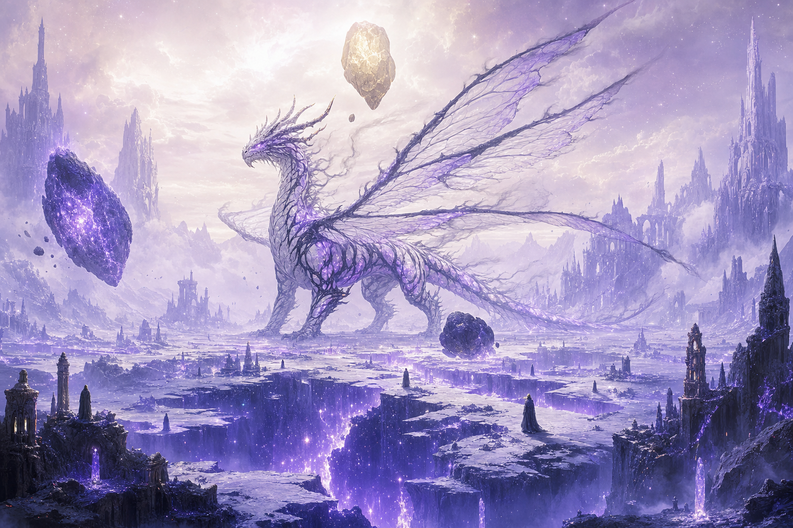

# Vorthrax, the Paradox of Dawn and Dusk



> Boss solo de CR 25 (duas fases) para **D&D 5ª edição — regras de 2024**, no formato de homebrew
> do [5e.tools](https://5e.tools). Calibrado para 4 aventureiros de nível 17 com itens muito raros
> e lendários.

Vorthrax é um arquidraco de luz (4 asas, 4 patas) corrompido pela Escuridão Primordial. A fusão das
duas naturezas o enlouqueceu — e o tornou incapaz de morrer: cada vez que cai, o tempo rebobina um
segundo e uma cópia nova é puxada ao presente, mais forte que a anterior, deixando no chão uma
cicatriz permanente de céu noturno e derretendo o xilema de Gaia, a Árvore-Mundo.

📖 **[Leia a história completa e a explicação do paradoxo (em português) →](HISTORIA.pt-BR.md)**
🌌 **[Tratado de cenário: o sub-céu, luz+sombra, deuses e aberrações →](PARADOXO.pt-BR.md)**

## Conteúdo

| Arquivo | O que é |
|---|---|
| ⭐ [`Ninja12749; Bonfire Paradox - Os Verdadeiros Viloes de Gaia.json`](Ninja12749%3B%20Bonfire%20Paradox%20-%20Os%20Verdadeiros%20Viloes%20de%20Gaia.json) | **TODAS as 47 criaturas num só arquivo** (inclui os sets oneshot do Sawjaw Rex e da Aureli), sob a **fonte única `VPX`** (do CR 1 ao 30) — toda a coleção aparece com a mesma sigla no Roll20/5e.tools. Importe só este e o bestiário inteiro do Paradoxo de Gaia aparece de uma vez. Use **ESTE _ou_ os arquivos separados abaixo** — não os dois juntos (evita conflito de fontes duplicadas) |
| [`Ninja12749; Vorthrax, the Paradox of Dawn and Dusk.json`](Ninja12749%3B%20Vorthrax%2C%20the%20Paradox%20of%20Dawn%20and%20Dusk.json) | **4 fichas** (inglês), formato 5e.tools, edição 2024: Vorthrax + as 3 esferas (Dawnwheel, Duskwheel, Voidwheel) |
| [`Ninja12749; Paradox-Touched Warband.json`](Ninja12749%3B%20Paradox-Touched%20Warband.json) | **6 fichas** (fonte PTW): goblins e kobolds tocados-pelo-paradoxo — guerreiro / arqueiro / conjurador de cada — como *glass-cannon minions* CR 17 (batem como tier 4, morrem como mooks), afinados para o mesmo grupo do Vorthrax (4 PCs nível 17 bem equipados). Plano de encontro embutido na lore do Goblin Hexer |
| [`Ninja12749; Astral Tyrannosaur.json`](Ninja12749%3B%20Astral%20Tyrannosaur.json) | **1 ficha** (fonte AST): T-Rex tocado-pelo-paradoxo com olhos-estrela que disparam laser (feixe único à vontade + *Annihilation Gaze* em linha) e que se teleporta o tempo todo (Blinkstep + Phase Out). Elite CR 18 **sem ações lendárias** — mini-boss ideal para liderar a warband |
| [`Ninja12749; Paradox Apoptosis (Os Apagados).json`](Ninja12749%3B%20Paradox%20Apoptosis%20%28Os%20Apagados%29.json) | **12 fichas** (fonte PXA, todas com a tag `paradox`): a facção *Apoptose / Os Apagados* — aberrações, construtos, anjos (celestial) e ínferos (fiend) nascidos do paradoxo de Gaia, cores impossíveis e alta magia arcana, medieval sem tecnologia. CR 14–20, todas no molde de dificuldade do Astral Tyrannosaur (elite, sem lendárias), com 3 bosses-contraparte CR 20. Planejamento em [`PLANO-Apoptose-de-Gaia.pt-BR.md`](PLANO-Apoptose-de-Gaia.pt-BR.md) |
| [`Ninja12749; Granveyra, Paradox Champion.json`](Ninja12749%3B%20Granveyra%2C%20Paradox%20Champion.json) | **2 fichas** (fonte PXC, tag `paradox`): boss lendária **CR 25** de duas fases: a espadachim meio-dragão (*Vaporising Rebellion Sword*, *World-Ending Slash* com Morte/Corrupção, *Cut Through Reality*) que, ao cair, **ascende para a forma Conjuradora** (todos os golpes + magia de alto nível, entra pré-buffada com Aid/Haste/Fire Shield/Mirror Image/Stoneskin) |
| [`Ninja12749; Master Paradox Kitsune.json`](Ninja12749%3B%20Master%20Paradox%20Kitsune.json) | **2 fichas** (fonte PXK, tag `paradox`): a raposa-mestra dos elementos — full caster lendária mais forte que um lich, com os quatro grandes espíritos (Salamander/Undine/Sylph/Gnome), gravidade e meteoros. Começa **Pequena CR 24** e, pela mesma mecânica de renascimento, **ascende para a forma verdadeira Média CR 27** (à vontade: *fireball*/*lightning bolt*; 8º–9º: *meteor swarm*, *earthquake*, *reverse gravity*) |
| [`Ninja12749; Nyxariel, the Paradox Maou.json`](Ninja12749%3B%20Nyxariel%2C%20the%20Paradox%20Maou.json) | **3 fichas** (fonte PXM, tag `paradox`): **Nyxariel, a Paradox Maou** — o **boss final CR 30** de três fases, sempre o mesmo ser em versões diferentes: **Fase 1 a Falsa Deusa** celestial CR 28 → **Fase 2 a Maou Sama Lâmia** ínfero CR 29 (tirana-do-olhar mestra das trevas, rajadas de olho dano+controle, sem antimagia) → **Fase 3 a Filha do Caos** (aberração celestial+constructo+ínfero) CR 30. Para grupo nível 20 com itens mágicos; renascimento entre fases |
| [`Ninja12749; Chaos Consumed Forgotten Hero.json`](Ninja12749%3B%20Chaos%20Consumed%20Forgotten%20Hero.json) | **1 ficha** (fonte CCH, tag `paradox`): o herói ideal caído e consumido pelo caos — aberração (construct+humanoid) **CR 25 "glass-cannon minion"** (bate como tier 4, 135 PV, sem lendárias). **Sealed Sword**: dissipa magia ao acertar (*dispel magic*), aprisiona a alma ao matar (*soul cage*); lançar *remove curse* na espada liberta as almas e encerra/redime o herói |
| [`Ninja12749; Paradox Kaeru.json`](Ninja12749%3B%20Paradox%20Kaeru.json) | **1 ficha** (fonte PKR, tag `paradox`): a piada-mas-mortal — monstrosidade pequena de faca e lanterna, **CR 20 "glass-cannon minion" de um golpe só**. Anda devagar (6 m), 99 PV, **um único ataque** (Chef's Knife ~186 fixo: 120 perfurante + 66 do *Grudge*, sem cálculo nem save) que praticamente one-shota. Mate antes que ele te alcance |
| [`Ninja12749; Vaelroot, the Paradox Druid.json`](Ninja12749%3B%20Vaelroot%2C%20the%20Paradox%20Druid.json) | **3 fichas** (fonte PXD, tag `paradox`): **Vaelroot, o Druida do Paradoxo** — boss de **três fases** servo do Vorthrax, feito o "jardineiro" da região corrompida. Mesma criatura renascendo a cada queda: **Fase Luz** *Verdant Dawn* (planta CR 15) → **Fase Sombra** *Withering Dusk* (fada CR 16) → **Fase Energia** *Unmade Bloom* (aberração CR 17). O foco é **interagir com o mapa**: *Reshape the Scene* lê o que há no terreno (uma **pedra**, uma **árvore**, a **grama**) e o arma — e, em terreno vazio, **puxa cenário do sub-céu**; *Sapway Step* o teleporta de planta/pedra em planta/pedra pelas veias de Gaia. Tudo com o toque paradox/Apagados (violeta → sangrar preto → branquear o chão). Calibrado para **6 aventureiros nível 15** com item raro + muito raro. 📖 Lore: [`VAELROOT.pt-BR.md`](VAELROOT.pt-BR.md) |
| [`Ninja12749; The False Wizards.json`](Ninja12749%3B%20The%20False%20Wizards.json) | **5 fichas** (fonte FWZ, tag `paradox`): os **Falsos Magos** — Apagados que espelham (ao contrário) a equipe do servidor, com piscadela ao papel e mecânica padrão de D&D. **Roxo** (mídia → fada ilusionista/charme, CR 21), **Verde** (regras → fiend rules-lawyer, CR 22), **Vermelho** (admin/grana → aberração que drena recursos, CR 23), **Marrom** (devmaster → construto que solta autômatos e dá "patch", CR 24), **Azul** (lore/canon → aberração que faz *retcon* e te declara não-canônico, CR 25). Bosses de 1 fase, lendários |
| [`HISTORIA.pt-BR.md`](HISTORIA.pt-BR.md) | História, cosmologia de Gaia e a explicação do paradoxo (português) |
| [`PARADOXO.pt-BR.md`](PARADOXO.pt-BR.md) | Tratado de cenário: o que é o paradoxo, bolsas/demiplanos e o xilema, o céu no chão, luz+sombra, espaços de paradoxo, deuses, anjos, demônios e aberrações (português) |
| [`VAELROOT.pt-BR.md`](VAELROOT.pt-BR.md) | Lore do **Vaelroot, o Jardineiro da Ferida** — quem era o druida de Gaia, a corrupção em "jardineiro" do Vorthrax, as três estações (Luz → Sombra → Energia), como ele usa o cenário (pedra/árvore/grama + sub-céu) e o papel dele entre Vorthrax e Os Apagados; com ganchos e dicas de mesa (português) |

## Bônus — fichas avulsas (fora do tema paradoxo)

Criaturas de *oneshot* que **não** fazem parte da facção de Gaia, guardadas aqui por conveniência.
A pasta `oneshots/` mantém o arquivo **avulso** (fonte própria **SJR**) para import isolado; o set
também já está **incluído no bestiário combinado `VPX`** (consolidado como VPX, junto das demais).

| Arquivo | O que é |
|---|---|
| [`oneshots/Ninja12749; Sawjaw Rex, the Steam Tyrant.json`](oneshots/Ninja12749%3B%20Sawjaw%20Rex%2C%20the%20Steam%20Tyrant.json) | **2 fichas** (fonte SJR): **Sawjaw Rex** — tiranossauro *steampunk* com serra elétrica no braço direito, canhão-caldeira a vapor nas costas (mochila) e cuspe de fogo. Boss de **2 estágios**: vivo (Monstruosidade CR 11) → ao morrer a caldeira pilota o cadáver como **construto** "Runaway Boiler" (CR 12) com **ponto fraco destrutível** (a caldeira: 40 PV, vulnerável a frio, detona ao quebrar). Encontro **Difícil** para 4 PCs nível 8 bem equipados (paladino/clérigo da vida/caçador/feiticeiro). *Tema steampunk — fora do cânone medieval do Gaia.* |
| [`oneshots/Ninja12749; Aureli, Treasurer-General of the Shogun.json`](oneshots/Ninja12749%3B%20Aureli%2C%20Treasurer-General%20of%20the%20Shogun.json) | **2 fichas** (fonte AUR): **Aureli** — comandante-tesoureira elfa solar do Xogum, com bandeira, leque que desvia tiros, 5 mosquetes flutuantes, bombas de luz que cegam e **estátuas de adamantina/mithral/prata/ouro**; mais o minion elite **Solar Elf Shadow Kensei** (monge das sombras que teleporta no escuro + mosquete). Boss elite **CR 15** + adds CR 6, encontro **Difícil** para 5 PCs nível 11 (3 clérigos / 2 caçadores). *Tema wuxia/samurai — fora do cânone do Gaia.* |

## Destaques da ficha

- **CR 25 (26 no covil)** — 487 PV por vida, CA 22, deslocamento 36 m (120 ft) + teleporte bônus
- **Renascimento Paradoxal**: a 1ª morte no combate o devolve no round seguinte com PV cheios e
  bônus cumulativos (Marca de Paradoxo); mortes seguintes o afastam por 12 h → 1 dia → 1 semana →
  1 mês, sempre dobrando
- **As Três Rodas**: 3 pedras Ioun gigantes orbitando (dano radiante/necrótico/força, CD 24) —
  destrutíveis, cada uma alimenta um poder dele, e agora com **ficha própria** (Dawnwheel,
  Duskwheel, Voidwheel), incluindo a descrição de **como cada uma se movimenta** (a *Bound Orbit*):
  a Dawnwheel sobe alto, a Duskwheel arrasta rente ao chão, a Voidwheel pisca fora de sincronia
- **Sopro Estrela Negra** (a magia *dark star*): esfera de escuridão, silêncio e gravidade que
  desintegra a 0 PV, durando 1 round
- **Garras Quebra-Força**: dano de força; destroem *wall of force*, *forcecage* e *shield* no contato
- **Casca Paradoxal**: resistência física em luz plena ou escuridão — vulnerável apenas na penumbra
- ***Dispel magic* como ação lendária**, imunidade a radiante + necrótico, efeitos regionais de
  corrupção completos

## Como importar

### 5e.tools (recomendado)

**Opção A — por URL (repo público):** em qualquer página do site, `⚙️` → **Manage Homebrew** →
**Load from URL** e cole:

```
https://raw.githubusercontent.com/Ninaji/vorthrax-paradox-dragon/main/Ninja12749%3B%20Vorthrax%2C%20the%20Paradox%20of%20Dawn%20and%20Dusk.json
```
 ou para o bestiario completo
```
https://raw.githubusercontent.com/Ninaji/vorthrax-paradox-dragon/main/Ninja12749%3B%20Bonfire%20Paradox%20-%20Os%20Verdadeiros%20Viloes%20de%20Gaia.json
```
 
**Opção B — por arquivo:** baixe o `.json` deste repositório e use **Manage Homebrew → Upload File**.

O Vorthrax aparece no Bestiário sob a fonte **VPX** (*Vorthrax, the Paradox of Dawn and Dusk*).

### Roll20 (betteR20) / Foundry (Plutonium)

Ambos importam JSON no formato 5e.tools nativamente: carregue o arquivo (ou a URL raw acima) no
gerenciador de homebrew do script e arraste o Vorthrax para a mesa.

### Submissão ao repositório oficial de homebrew

O arquivo já segue as convenções do [repositório oficial](https://github.com/TheGiddyLimit/homebrew)
(`_meta` completo, edição `one`, nome no padrão `Autor; Nome do Brew.json`). Para submeter: fork,
copie o JSON para a pasta `creature/` e abra um pull request — o CI valida o schema automaticamente.

---

*In English: Vorthrax is a CR 25 two-phase solo boss for D&D 5e (2024 rules) in 5e.tools homebrew
JSON format — a light archdraco corrupted by primordial darkness, cursed with a time-paradox
rebirth. Full statblock in the JSON (English); lore document in Brazilian Portuguese.*
